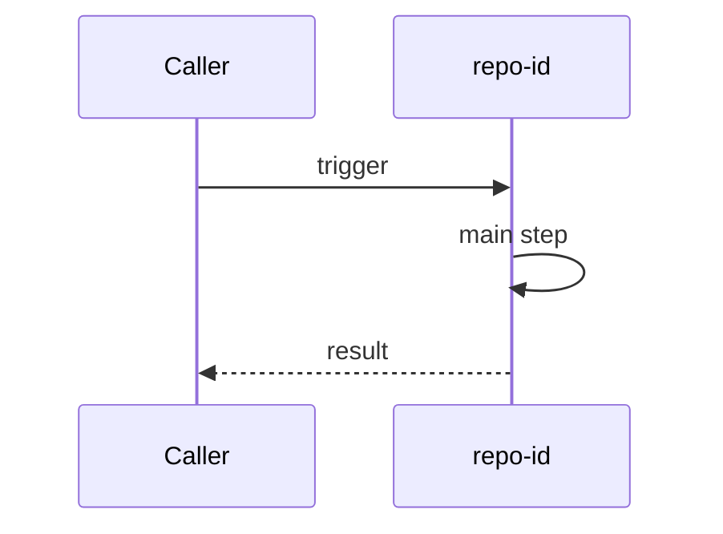

# Flow name

## Purpose

When this flow runs, and what a change to it must keep working.

## Sequence

## Steps

1. **What happens first.** Why here and in this order. `repo:repo-id/path/to/entry.ext#entry_symbol`
2. **What happens next.** Cite every step's code, and list each citation in `evidence`.

## Contracts

Only when the flow crosses repositories: the API, message, file or table each side relies on, and which repository owns it.

## Limits

What this flow leaves out, such as error paths or configuration it does not cover.
